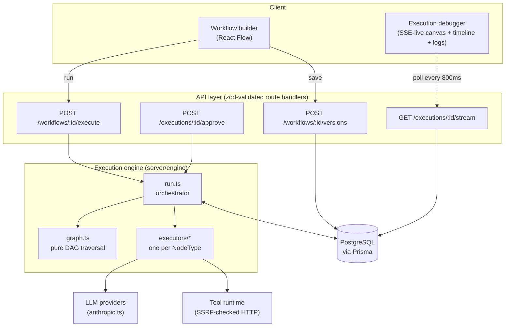
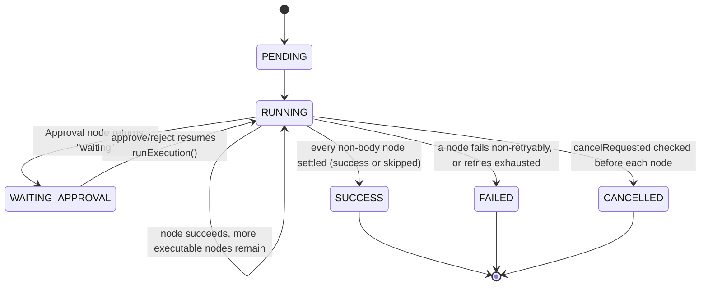

# Circuit

An agentic workflow orchestration platform for visually building, executing, and debugging stateful AI workflows.

Circuit lets you compose triggers, LLM agent calls, HTTP tools, conditional
branches, loops, delays, and human-approval gates into a graph, then
actually run that graph through a backend orchestrator with retries,
branch-skip propagation, cancellation, live observability, and replay. The
frontend graph is a *representation* of execution — a separate,
independent backend engine does the real dependency resolution and state
propagation against PostgreSQL.

**Why this is technically interesting:** most workflow-builder side
projects fake the execution — the UI looks like an orchestration
platform, but underneath it's calling functions top-to-bottom in the
order they're drawn. The hard parts of a real orchestration engine are
exactly the parts a fake one skips: knowing when a node is *skipped* vs.
*pending* vs. *blocked*, making a paused execution resumable from
persisted state instead of memory, and proving both of those under test
rather than by inspection. See [Bugs Found and Fixed](#bugs-found-and-fixed)
for the clearest evidence of that.

## Demo

No live deployment exists. This is a local-first project — see
[Local Development](#local-development) to run it.

## Why Circuit?

Visual workflow automation (n8n, Temporal, LangGraph-shaped tools) solves
a real problem: composing LLM calls and API calls into something
non-engineers can read and engineers can debug. The interesting
engineering problem isn't the drag-and-drop canvas — it's the scheduler
underneath it. Circuit's execution engine does real DAG traversal:
dependency resolution, branch-aware scheduling, retry with backoff, and
explicit skip-propagation for the losing branch of a Condition — and the
UI exists to make that engine's actual behavior observable, not to imply
behavior that isn't there.

## Features

Only what's actually implemented and working:

- Visual workflow builder (React Flow) — 9 node types, live client-side validation, multi-select, copy/paste, duplicate, undo/redo, snap-to-grid, alignment helpers, keyboard shortcuts
- Real backend DAG execution engine — dependency resolution, branch-aware scheduling, explicit skip propagation
- Retry with exponential backoff, retryable vs. non-retryable failure classification
- Immutable workflow versioning — a run always references the exact graph that produced it
- Real LLM calls (Anthropic Messages API) and HTTP tool calls (SSRF-protected)
- Live execution debugger — SSE-streamed status, execution timeline, per-node input/state/logs inspector, condition-evaluation detail
- Replay, including "replay from failed node"
- Workflow library and Runs page with real search/filter/sort
- 4 runnable templates with graph previews derived from their actual stored structure
- Auth (JWT sessions), workspace-scoped authorization (partially swept — see [Known Limitations](#known-limitations)), AES-256-GCM credential encryption, rate limiting
- Command palette, keyboard-navigable dialogs with focus trapping and restoration
- Measured WCAG contrast compliance across the design system

## Architecture



`src/server/engine/graph.ts` is deliberately I/O-free — pure functions
over `{ nodes, edges }` — so traversal logic is unit-testable without a
database, and could later move into a queue worker unchanged (see
[Roadmap](#roadmap)). `src/components/workflow/graphActions.ts` mirrors
this on the client side: every canvas mutation (add/delete/connect/paste/
align node) is a pure function over a graph snapshot, so the React
component is a thin wrapper and undo/redo is directly testable (see
[Testing](#testing)).

### Execution state machine



## Execution Model

A workflow graph is nodes (`WorkflowNode`: key, type, config, position)
and edges (`WorkflowEdge`: source key, target key, optional branch
handle). `engine/graph.ts` operates on this as plain data:

- **Executable**: a node is ready to run when every incoming edge's
  source has settled to a non-failed status, and — for a branch edge
  (a Condition's `"true"`/`"false"`, a Loop's `"loop"`/`"done"`) — the
  source's chosen handle matches the edge.
- **Skipped**: a node whose incoming sources have all settled, but none
  of them route here (the untaken branch of a Condition). This is a real,
  explicit state the engine records — not the absence of a state. See
  [Bugs Found and Fixed](#bugs-found-and-fixed) for why that distinction
  mattered.
- **Not executed**: no `NodeExecution` row exists for this node at all —
  either the run hasn't reached it yet, or the run ended (failed/
  cancelled) before it could. The debugger UI derives this from whether a
  row exists, not from inference.
- **Complete**: every non-loop-body node has a settled status
  (`success` or `skipped`) in the traversal's `completed` map.

State passes between nodes through a single `WorkflowState` object
(`{ trigger, nodes, variables }`) threaded through the whole execution;
each node's output is written to `state.nodes[key].output`, and
downstream nodes reference it with `{{nodes.analyzer.output.priority}}`-style
paths resolved by `engine/state.ts` — manual property traversal only, no
`eval`, no `Function()` constructor.

Failures: every node executor returns `success`, `failed` (carrying
`retryable: boolean`), `skipped`, or `waiting`. Retryable failures get
exponential backoff up to 3 attempts (`DEFAULT_MAX_ATTEMPTS`); each
attempt is its own persisted `NodeExecution` row.

## Condition Evaluation

The Condition executor (`executors/condition.ts`) resolves both operands
through the same `{{path}}` resolver every node uses, compares them with a
real operator (`==`, `!=`, `>`, `<`, `contains`), and returns
`{ result, handle, resolvedLeft, resolvedRight }` — the resolved values
are included specifically so the debugger can show what actually happened
without recalculating anything:

```
Expression:  {{nodes.analyzer.output.priority}} == "high"
Resolved:    "high" == "high"
Result:      TRUE
Selected:    true   (routes to whichever edge has sourceHandle: "true")
```

The UI never re-derives this — `ConditionResult` in `ExecutionDebugger.tsx`
renders these four fields directly from the node's real `NodeExecution.output`.

## Real-Time Execution

`GET /api/executions/:id/stream` is Server-Sent Events — but the honest
version: it polls Postgres every 800ms and diffs, rather than a true
pub/sub layer (documented in the route's own comment; a production
version would move to Postgres LISTEN/NOTIFY or a broker — see
[Roadmap](#roadmap)).

Lifecycle, and why it matters: `EventSource` cannot distinguish "the
server closed the connection because the run finished" from "the
connection actually died" — both surface as the same client-side `error`
event. An earlier version of this hook treated every `error` event as a
lost connection, which meant **every successful execution would have
shown a false "connection lost" warning** right at the end. The fix:
the client closes the connection itself the moment a terminal-status
snapshot arrives, so the server's own subsequent close never triggers an
`error` event in the first place. Regression-tested in
`useExecutionStream.test.tsx` against a fake `EventSource` (jsdom has no
native implementation) covering: clean success, clean failure, a genuine
dropped connection, and that unmounting actually closes the connection
rather than leaking it.

## Execution Debugger

Reuses the same `CircuitNode` component as the builder, in read-only mode,
so the debugger canvas *is* the builder canvas with live state instead of
a separate reimplementation. Provides:

- Aggregate stats (duration, node counts by status) computed from real
  `NodeExecution` rows, not estimated
- Skipped nodes rendered visually distinct (dimmed, dashed incoming edge)
  from nodes that simply haven't executed yet
- A chronological timeline built from real `ExecutionLog` rows with
  computed relative offsets — clicking an event opens that node's detail
- Per-node tabs: Output, State (the full `WorkflowState` snapshot at that
  node's execution — labeled honestly as that, not as a separate "input"
  concept, since `NodeExecution.input` and this state are the same object),
  and Logs filtered to that node
- Condition nodes show the four-field breakdown described above
- Replay and "replay from failed node"

## Tech Stack

Derived from `package.json` — nothing here isn't actually a dependency:

**Runtime**: Next.js 15 (App Router), React 19, TypeScript (strict,
`noUncheckedIndexedAccess`)
**Data**: PostgreSQL via Prisma
**Canvas**: React Flow
**Styling**: Tailwind CSS
**Validation**: Zod
**Auth**: `jose` (JWT), `bcryptjs` (password hashing)
**LLM**: Anthropic Messages API — direct `fetch`, no SDK dependency
**Testing**: Vitest, `@testing-library/react`, jsdom
**Icons**: `lucide-react`

## Project Structure

```
prisma/schema.prisma        13 models — see Database below
prisma/seed.ts               Demo workspace + builtin tools/templates
src/app/                     Next.js routes: pages + API route handlers
src/components/workflow/     Canvas, node cards, config panels, pure graphActions.ts, client-side validateGraph()
src/components/runs/         Execution debugger, live SSE hook, timeline, logs panel
src/components/ui/           Toast system, skeletons, useFocusTrap
src/server/engine/           graph.ts (pure DAG logic), run.ts (orchestrator), executors/, types.ts
src/server/llm/               LLMProvider interface + Anthropic implementation
src/server/security/         SSRF checks, AES-256-GCM crypto, rate limiter
src/server/auth/              Password hashing, JWT sessions, workspace authorization
src/server/services/          Workflow/template/credential/dashboard services (Prisma-backed)
scripts/contrast-audit.mjs   Real WCAG contrast-ratio checker against the actual design tokens
```

## Engineering Decisions

**Why DAGs?** A workflow's execution order depends on runtime data (which
branch a Condition takes), not a fixed sequence — but it still can't
cycle, or it'd run forever. Loops are the one deliberate, bounded
exception (`maxIterations`), and cycle detection explicitly excludes
loop-body edges so that exception doesn't become a hole in the check.

**Why React Flow?** Handles pan/zoom/selection/connection UX correctly
out of the box; Circuit's job is the node/edge data model and the
execution semantics layered on top, not reimplementing canvas interaction.

**Why pure graph actions?** `graphActions.ts` (client) and `graph.ts`
(server) both keep mutation/traversal logic free of React state and
Prisma respectively. This is what makes undo/redo and DAG scheduling
directly unit-testable without a browser or database — and what let an
in-memory Prisma fake catch two real orchestration bugs (see below)
without ever touching a real database.

**How does undo/redo work?** A bounded (50-entry) `{past, present,
future}` history stack (`history.ts`). Every structural canvas change
(add/delete/connect/paste/align/config-edit) is one `graphActions.ts` call
whose result gets pushed as one history entry — selection changes and
in-progress drags are deliberately excluded so they don't pollute the
undo stack.

**How does clipboard ID remapping work?** `clipboard.ts`'s
`remapForPaste()` takes copied nodes/edges and a fresh-id generator,
returns new ids, offset positions, and edges remapped to the new ids —
edges pointing outside the copied set are dropped rather than left
dangling. Repeated `Cmd/Ctrl+V` of the same clipboard cascades outward
(40px, 80px, 120px, ...) via a paste-count ref that resets on each new
copy; `Cmd/Ctrl+D` (duplicate) doesn't need this because it re-reads the
live selection each call, which becomes the new selection after each
duplicate.

**Why SSE over WebSockets?** One-directional (server → client) status
updates don't need a bidirectional channel; SSE's automatic reconnection
and plain-HTTP transport were a better fit for a polling-backed
implementation than standing up a WebSocket server for this.

## Error Handling

Every async action surfaces a real toast on failure with the server's
actual error message (Canvas save/run/rename, replay, template use,
credential creation) rather than a generic message or a silent stall.
Two real silent-failure bugs were found and fixed during development:
create-workflow used to sit on "Creating workflow…" forever on error with
no feedback at all; the SSE hook used to drop connection errors with zero
indication the debugger had stopped updating (see
[Real-Time Execution](#real-time-execution) for the full story of that
one). No API route logs a stack trace back to the client, and
`Credential.encryptedValue` never appears in any API response — only a
masked preview does.

## Testing

Run `npm test` for the current count (110 as of this writing — check
the actual output, not this number, since it will drift). Breakdown:

| Layer | Coverage |
|---|---|
| DAG traversal (`graph.ts`) | Root-finding, cycle detection, executable + skip classification |
| Execution orchestration (`run.ts`) | In-memory Prisma fake exercising linear success, branching, and failure end-to-end |
| Client graph mutations (`graphActions.ts`) | Add/delete/connect/paste/align, combined with the real history module for explicit undo/redo scenario tests |
| Node executors | Condition (all operators, resolved-value exposure), Agent (mocked provider), Tool (mocked fetch + SSRF blocking) |
| Security | AES-256-GCM round-trip/tamper/wrong-key, SSRF IP ranges, rate limiter windowing, role comparison |
| SSE lifecycle | Clean success/failure close, genuine connection loss, unmount cleanup — against a fake `EventSource` |
| Accessibility (behavioral) | Focus-trap-on-open, Tab wraparound, focus-restoration-on-close, Escape-priority resolution |
| Content | Every builtin template actually passes `validateGraph()` — checked, not assumed |

Not covered, and not pretended to be: a real Postgres integration test,
and any E2E/browser test — both need infrastructure unavailable in the
environment these were developed in (see
[Browser Verification](#browser-verification-status) below).

## Accessibility

**Measured, not assumed.** `scripts/contrast-audit.mjs` computes real
WCAG 2.1 contrast ratios against the actual hex values in
`tailwind.config.ts`. The first run found 4 real failures (a tertiary
text color that didn't even clear the lenient 3:1 bar, and three status
colors under 4.5:1 for their actual small-text usage); all four were
corrected by computing — not guessing — darker values, verified by
re-running the script. All 18 checked pairings pass today.

**Behavioral accessibility, regression-tested:**
- Dialogs (`ShortcutsHelp`, `PreflightModal`) move focus in on open, trap
  Tab/Shift+Tab within themselves, and restore focus to whatever
  triggered them on close (`useFocusTrap.ts`, tested in
  `useFocusTrap.test.tsx` with real jsdom DOM focus assertions)
- Escape closes an open dialog before it ever reaches canvas selection —
  `resolveEscapeAction()` is a pure priority function with its own tests
- Status is never color-only: every state (success/failed/skipped/
  running/waiting) pairs a color with a text label
- Global `:focus-visible` outline restored for keyboard navigation
  specifically (most interactive elements set `outline-none` for their
  click state, which also strips keyboard focus visibility by default)

**Known incomplete:** the command palette uses `autoFocus` on its search
input rather than the full `useFocusTrap` pattern (it has its own
arrow-key navigation model that would conflict with a generic Tab trap),
and doesn't restore focus on close since it's keyboard-invoked globally
rather than triggered by a specific element.

## Local Development

```bash
npm install
cp .env.example .env        # fill in DATABASE_URL, JWT_SECRET, CREDENTIAL_ENCRYPTION_KEY
npm run prisma:generate
npm run prisma:migrate
npm run seed                 # creates a demo workspace + seeds builtin tools/templates
npm run dev
```

```bash
npm run dev          # local dev server
npm run build         # production build
npm run lint          # eslint
npm run typecheck     # tsc --noEmit
npm test               # vitest
npm run test:e2e     # playwright — not written yet, see Known Limitations
npm run seed           # demo workspace + builtin tools/templates
```

## Environment Variables

| Variable | Required | Description |
|---|---|---|
| `DATABASE_URL` | Yes | PostgreSQL connection string |
| `JWT_SECRET` | Yes | Session signing key (`server/auth/session.ts`) |
| `CREDENTIAL_ENCRYPTION_KEY` | Yes | AES-256-GCM key for stored credentials (`server/security/crypto.ts`) |
| `ANTHROPIC_API_KEY` | For Agent nodes | LLM calls (`server/llm/anthropic.ts`) |
| `OPENAI_API_KEY` | No | Reserved — provider not implemented, throws explicitly if selected |

See `.env.example` for the exact keys. Never commit `.env` — it's
gitignored.

## Database

PostgreSQL via Prisma (`prisma/schema.prisma`, 13 models: `User`,
`Workspace`, `WorkspaceMember`, `Workflow`, `WorkflowVersion`,
`WorkflowNode`, `WorkflowEdge`, `Execution`, `NodeExecution`,
`ExecutionLog`, `Tool`, `Credential`, `Template`). Key design decisions:

- `WorkflowVersion` is immutable — editing creates a new version;
  `Execution.workflowVersionId` pins each run to the exact graph that
  produced it, so historical runs stay reproducible after later edits.
- `NodeExecution` is keyed per node per attempt, so retry history is
  queryable without a separate table.
- `Credential.encryptedValue` is AES-256-GCM encrypted at rest; only
  `maskedPreview` is ever serialized to any API response.

## Security Considerations

Real measures: AES-256-GCM credential encryption (never returned from any
API), SSRF protection on the Tool executor (DNS-resolves the target
hostname and checks every resolved address against private/loopback/
link-local ranges — including the cloud metadata IP — before ever calling
`fetch`), bcrypt password hashing, JWT sessions in an httpOnly cookie,
zod validation on every API route body, and a fixed-window rate limiter
on signup/login/execute.

**Real, named limitations, not hidden:** workspace authorization
(`authorizeWorkspaceAccess`) is applied to workflow save/execute and
credentials routes but not swept across every route yet (Runs/Tools
listing endpoints are still open). Two client-side calls
(`TemplateCard.tsx`, `workflows/new/page.tsx`) POST a hardcoded empty
`workspaceId` because there's no workspace-switcher UI reading the
session yet — every server-side check is real, the client just isn't
passing the real value. The rate limiter is in-memory, correct only for a
single server instance. `prisma/seed.ts` prints a fixed placeholder demo
password (`demo-password-change-me`) to the console on seed — a known,
intentionally-obvious placeholder, not a real secret, but worth knowing
if you're watching CI logs.

## Known Limitations

- **Loop-body re-execution**: the Loop executor resolves and bounds an
  iteration list but doesn't re-execute a subgraph per item yet — only
  the bookkeeping exists. Real scheduling feature, not a config tweak.
- **Single-turn Agent tool-calling**: an Agent's requested tool calls are
  surfaced for the debugger to show, but the engine doesn't execute them
  and loop back for a second model turn. Tool-*aware*, not tool-*using*.
- **Partial authorization sweep** and **hardcoded `workspaceId`** in two
  client calls — see [Security Considerations](#security-considerations).
- **No real PostgreSQL integration test** — `run.integration.test.ts` uses
  an in-memory Prisma fake (see [Testing](#testing)); SQL correctness,
  transactions, and concurrent-execution behavior are unverified.
- **No E2E/browser test** — none written; the canvas, live SSE updates,
  and dialogs are verified by code/DOM-level testing, not a real browser.
- **GitHub/Slack/Email tools** are registered with real schemas but have
  no executor — only HTTP Request actually calls anything.
- **Command palette login gap**: no login page exists yet, only the API
  routes — signup/login can only be exercised directly against the API.
- **Auto-layout not implemented** — deliberately out of scope for this
  pass rather than faked with an approximation.

## Roadmap

Real future work, not implemented functionality dressed up as a plan:

- Move execution off in-process into a queue + worker pool (API → enqueue
  → Queue → Worker pool → same `runExecution()` engine functions,
  unchanged) — `NodeExecution` is already keyed by
  `(executionId, nodeId, attempt)` for future idempotency
- Postgres LISTEN/NOTIFY (or a broker) replacing the current 800ms-poll
  SSE implementation
- Loop-body re-execution as a real subgraph-per-item scheduling feature
- Multi-turn Agent tool-calling loop with a max-turns guard
- Complete the authorization sweep across every API route
- A real Postgres integration test and a Playwright E2E suite
- A login/signup page wiring the existing API routes into the UI

## Bugs Found and Fixed

Two were found and fixed while writing an in-memory-Prisma-fake
integration test for the execution engine — not staged, not hypothetical:

**Unreachable branch deadlock.** `findExecutableNodes` correctly excluded
a Condition's untaken branch from what's executable, but nothing else
ever marked it *done* — it simply never entered the `completed` map, so
every workflow with a real branch stalled forever. Unit tests had missed
it because the existing test *pre-seeded* the losing branch as already
skipped, never asking whether anything actually puts it there. Fixed by
adding `findSkippedNodes` to `graph.ts`, called every loop iteration
before computing what's executable.

**Trigger persistence gap.** The Trigger node was seeded directly into the
completed map with a fabricated result instead of running through the
normal executor/retry/persistence path every other node uses — so a
successful Trigger never produced a `NodeExecution` row, and the debugger
would have shown the one node guaranteed to have run as if it never did.
Fixed by routing root nodes through the same `runNodeWithRetry` path as
everything else.

A later pass found a third, subtler one: the **SSE false-connection-lost**
bug described in [Real-Time Execution](#real-time-execution).

## Interview Talking Points

**1. Why DAG execution?** Because a workflow's execution order depends on
runtime data — which branch a Condition resolves to isn't known until the
graph runs — but it still can't be allowed to cycle indefinitely.

**2. How does execution order work?** `findExecutableNodes(graph,
completed)` — a node is ready when every incoming edge's source has
settled and, for branch edges, the source picked the matching handle.
Pure, unit-tested independent of any database.

**3. How does state pass between nodes?** A single `WorkflowState`
threaded through the whole run; each node writes its output to
`state.nodes[key].output`, and downstream nodes reference it via
`{{path}}` expressions resolved by manual property traversal (no `eval`).

**4. How are conditions evaluated?** Both operands resolved through the
same path-resolver every node uses, compared with a real operator, and
the resolved values (not just the result) are returned in the node's
output specifically so the UI never has to recalculate anything.

**5. How are skipped nodes determined?** `findSkippedNodes` — every
incoming edge's source has settled, but none of them route here. This is
a real, engine-recorded state (with its own `NodeExecution` row), not the
UI inferring "probably skipped" from an absence of data.

**6. How does the debugger know what happened?** Entirely from persisted
`NodeExecution`/`ExecutionLog` rows — it derives status, not-executed-vs-
skipped, timing, and condition results from what actually got written to
the database during the run.

**7. Why were graph mutations extracted into pure functions?** So
undo/redo and DAG traversal are directly unit-testable without a browser
or database, and so the pure logic can move into a future queue worker
(server side) or be reused (client side) without dragging React or Prisma
along with it.

**8. How does undo/redo work?** A bounded `{past, present, future}` stack;
every structural canvas change is one pure `graphActions.ts` call whose
result becomes one history entry.

**9. How does copy/paste remap IDs?** `remapForPaste()` builds an
old-id→new-id map while generating fresh ids, then rewrites edges through
that map — an edge pointing outside the copied set is dropped rather than
left dangling on an id that no longer exists.

**10. How are internal edges preserved (and external ones excluded)?**
Only edges where *both* endpoints are in the copied/selected set survive
the copy — this is checked directly in `pasteAction`'s remap step, tested
explicitly in `graphActions.test.ts`.

**11. How does SSE work here?** Poll-and-diff against Postgres every
800ms, honestly documented as such rather than dressed up as true
pub/sub.

**12. How do you distinguish clean completion from connection failure?**
The client proactively closes its own `EventSource` the instant a
terminal-status snapshot arrives, so the server's subsequent close never
triggers a browser-level `error` event that would otherwise be
indistinguishable from a real dropped connection.

**13. How are execution errors handled?** Every node executor returns a
typed result (`success`/`failed`/`skipped`/`waiting`); retryable failures
back off exponentially up to 3 attempts, each attempt persisted as its
own row; a terminal failure marks the whole execution `FAILED` with the
real error logged.

**14. How is the workflow graph validated?** `validateGraph()` — shared,
pure, client- and server-run (the save API re-runs it before persisting,
never trusting client-side validation alone) — checks for missing/
duplicate triggers, cycles, unreachable nodes, missing Condition branches,
and per-type required config.

**15. How would you scale this system?** Move `runExecution()` behind a
queue instead of calling it synchronously from the request handler —
the function itself doesn't need to change, since it already rebuilds its
state from Postgres on every call rather than trusting in-memory state.

**16. How would you implement retries (further)?** They already exist per
node; extending them would mean per-node-type retry policy overrides
(currently a single global `DEFAULT_MAX_ATTEMPTS`) and jittered backoff
for better behavior under concurrent load.

**17. How would you support distributed execution?** Stateless workers
pulling `executionId`s off a queue, each calling the same
`runExecution()` — safe because state lives in Postgres, not worker
memory. The missing piece today is a lock (`SELECT ... FOR UPDATE` on the
`Execution` row) preventing two workers from claiming the same node.

**18. How would you add authentication and authorization (further)?** The
primitives already exist (JWT sessions, `authorizeWorkspaceAccess`); what
remains is sweeping it across every route and building the login/signup
UI the API already supports.

**19. What are the current limitations?** See
[Known Limitations](#known-limitations) — named directly rather than
implied away.

**20. What would you build next?** Real Postgres integration testing
first (closes the biggest verification gap), then the multi-turn Agent
tool-calling loop and loop-body re-execution — in that order, because the
first is a verification gap and the other two are feature gaps, and it's
worth knowing what already works before building more on top of it.

## Interview Questions

Concise Q&A grounded in the actual implementation:

**Q: What's the difference between "skipped" and "not executed"?**
A: Skipped is a real engine-recorded state — the untaken branch of a
Condition, with its own `NodeExecution` row. Not-executed means no row
exists at all, because the run either hasn't reached that node yet or
ended before it could.

**Q: Why is `WorkflowVersion` immutable?** A: So a historical execution
stays reproducible — it references the exact graph that ran, even if the
workflow gets edited again later.

**Q: What does `NodeExecutor.validate()` do?** A: Less than its type
signature implies — it's declared and implemented by every executor but
never actually called anywhere in the app; `validateGraph()` does all
real validation independently. Named explicitly as a gap between the
interface and what's wired up, not hidden.

**Q: How do you know the contrast fixes actually pass?** A: They're
computed by `scripts/contrast-audit.mjs`, a real WCAG 2.1 calculator
against the literal hex values in the design system — not eyeballed.

**Q: Why an in-memory Prisma fake instead of real Postgres for the
engine test?** A: No database was reachable in the environment this was
developed in; the fake was the only way to exercise the orchestration
loop's actual control flow rather than only its pure dependencies, and
it's how two real bugs were found. Explicitly not equivalent to real
Postgres testing — stated multiple times in this README, not once.

**Q: How does the focus trap work, and how do you know it works?** A: A
`useFocusTrap` hook moves focus into a dialog on mount, traps Tab/
Shift+Tab within it, and restores focus on unmount — tested with real
jsdom DOM focus assertions (`toHaveFocus()`), not simulated.

**Q: What happens if two people run the same workflow at once?** A:
Today, nothing prevents it — this is a named gap, not a solved problem.
The schema is shaped for a future fix (`NodeExecution` keyed by attempt)
but no lock currently exists.

**Q: Why manual `{{path}}` resolution instead of a template library?**
A: To guarantee no code execution path exists — `resolvePath` only ever
does property traversal on a plain object, with a test specifically
checking that an unresolvable path (e.g. `process.exit`) returns
`undefined` rather than doing anything resembling evaluation.

**Q: How is a credential ever used without ever being exposed?**
A: `resolveCredentialForExecution()` is the only function in the codebase
that decrypts a credential, called only by the execution engine — every
API response path only ever serializes `maskedPreview`.

**Q: What's the biggest thing you'd fix before calling this
production-ready?** A: Real Postgres integration tests and finishing the
authorization sweep — both are named, bounded gaps, not open-ended risk.

**Q: How did you verify the UI without a browser?** A: I didn't claim to
— see [Browser Verification Status](#browser-verification-status).
Everything UI-related is verified by TypeScript, ESLint, and jsdom-based
DOM/focus assertions instead.

**Q: What's one thing you'd redesign?** A: `NodeExecutor.validate()` — I'd
either wire it into the save flow for real or remove it; leaving a
specified-but-unused interface method overstates what's actually
connected.

**Q: How do templates guarantee they're not stale relative to the
validator?** A: `templates.test.ts` runs every builtin template through
the real `validateGraph()` the builder uses — checked on every test run,
not assumed to still be valid as the validator evolves.

**Q: Why extract `resolveEscapeAction` into its own pure function?**
A: So the modal-closes-before-selection-clears priority has a direct,
fast unit test independent of simulating actual keyboard events in a
browser.

**Q: What would concurrent workflow execution testing look like?**
A: Two processes calling `runExecution()` on the same `executionId`
simultaneously, asserting no duplicate `NodeExecution` rows are created
for the same node/attempt — not currently written, since it needs real
Postgres.

**Q: How do you avoid displaying fake data anywhere in the app?**
A: Every metric, count, and status shown in the UI is a direct read from
Prisma — dashboards, run tables, and node inspectors all query real rows;
there's no synthetic/placeholder data path anywhere in the render logic.

See [`INTERVIEW.md`](./INTERVIEW.md) for a longer-form companion covering
architecture, orchestration, persistence, security, testing, and system
design in more depth (58 questions total) — this section stays a concise
summary; that file is the deep dive.

## Browser Verification Status

**Browser verification is unavailable in the environment this project was
developed in.** No browser binary exists, and the environment's egress
proxy explicitly blocks the Playwright CDN download
(`host_not_allowed`). This was verified by actually attempting
`npx playwright install chromium --with-deps` (failed on a forbidden apt
repo), not assumed.

Everything in this README that could be checked without a browser was:
automated tests (110 passing), lint (0 errors), `tsc --noEmit` (compared
against a documented baseline of Prisma-client-generation artifacts — the
Prisma client can't be generated either, since `binaries.prisma.sh` isn't
reachable from this environment), a real computed contrast audit, and
jsdom-based DOM/focus assertions for dialog behavior and SSE lifecycle.

None of this substitutes for actually opening the app in a browser and
clicking through it. **Recommended next step: manual browser QA** —
`npm run dev` against a real Postgres instance (e.g. a free Neon project)
in an environment with normal network access, then walk through workflow
creation, the builder (multi-select, copy/paste, snap-to-grid, alignment),
running a workflow, the live debugger, and replay.

## GitHub Presentation

No screenshots, GIFs, or architecture image assets exist in this
repository — none are referenced or invented here. If you add them later,
`docs/screenshots/` for UI captures and `docs/architecture/` for diagram
exports are reasonable places to put them; the Mermaid diagrams above
render directly on GitHub without needing image files at all.
